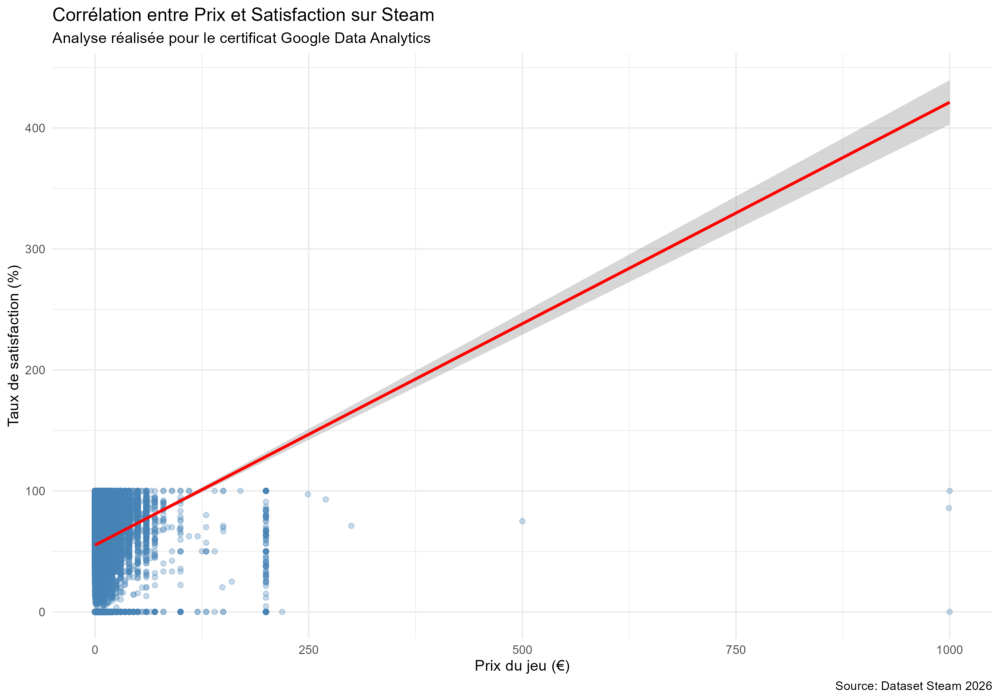

# 🎮 Étude de Cas : Analyse du Marché Steam (2026)
### *Projet de fin d'études - Certificat Professionnel Google Data Analytics*

## 📝 1. PHASE : ASK (Poser les questions)
**Objectif :** Aider un studio de jeux vidéo indépendant à définir sa stratégie de lancement sur Steam.

**Questions clés :**
1. Quelles combinaisons de genres affichent les meilleurs taux de satisfaction ?
2. Quel est l'impact du prix sur le taux de réussite (Success Rate) ?
3. Quel est le "Sweet Spot" tarifaire pour maximiser les avis positifs ?

---

## 📥 2. PHASE : PREPARE (Préparer les données)
* **Source des données :** Dataset extrait de l'API Steam (données réelles 2026).
* **Outils utilisés :** * **SQL (MySQL)** : Nettoyage en profondeur et agrégations.
    * **R (Tidyverse)** : Analyse de corrélation et visualisation graphique.
    * **Markdown** : Documentation du projet sur GitHub.

---

## 🧹 3. PHASE : PROCESS (Traiter / Nettoyer)
Le nettoyage a été réalisé en SQL pour transformer les données brutes en un dataset prêt pour l'analyse.

**Actions réalisées :**
* Transformation des dates de sortie au format standard `YYYY-MM-DD`.
* Suppression des caractères spéciaux dans les colonnes `genres` et `developers`.
* Création du KPI **Success Rate** : ratio entre avis positifs et total des avis.

```sql
-- Calcul du Success Rate (KPI principal)
ALTER TABLE games_cleaned ADD COLUMN success_rate DECIMAL(5,2);

UPDATE games_cleaned 
SET success_rate = (positive / (positive + negative)) * 100
WHERE (positive + negative) > 0;
```

---

## 📊 4. PHASE : ANALYZE & VISUALIZE (Analyser et Visualiser)

### 4.1 Analyse des Genres (SQL)
L'analyse SQL a révélé que les genres hybrides génèrent un engagement plus fort :
| Mix de Genres | Nombre de Jeux | Satisfaction Moyenne |
| :--- | :--- | :--- |
| **Action, Indie, Racing** | 172 | **77.02%** |
| **Action, Casual, Indie** | 154 | **73.32%** |

### 4.2 Analyse Statistique (R)
Grâce à R, j'ai analysé la corrélation entre le prix et la satisfaction client.

```r
# Code utilisé pour la visualisation
ggplot(data = steam_data, aes(x = price, y = success_rate)) +
  geom_jitter(alpha = 0.3, color = "steelblue") + 
  geom_smooth(method = "lm", color = "red") +
  labs(title = "Corrélation Prix vs Satisfaction",
       x = "Prix (€)", y = "Taux de satisfaction (%)") +
  theme_minimal()
```

**Résultat visuel :**

*(Note : Si l'image ne s'affiche pas, consultez le fichier graphique_final_steam.png dans ce dépôt)*

---

## 📈 5. PHASE : SHARE & ACT (Partager et Agir)

### Conclusions clés :
1. **Stabilité des prix :** Les jeux vendus entre **15€ et 25€** affichent une satisfaction plus constante et élevée que les jeux gratuits (F2P), souvent sujets à des avis plus volatils.
2. **Niches rentables :** Le mélange des genres Action et Racing est sous-représenté mais très apprécié.

### Recommandations :
* **Développement :** S'orienter vers un jeu hybride (Action/Indie/Racing).
* **Prix :** Fixer un prix de lancement à **19.99€** pour se positionner dans la zone de haute satisfaction.

---

## 📁 Structure du Repository
* `cleaning_and_analysis.sql` : Scripts de nettoyage et agrégation SQL.
* `visualisation_stats.R` : Script d'analyse et de visualisation R.
* `visualisation/` : Dossier contenant les exports graphiques (PNG).
* `games_cleaned.csv` : Dataset final après traitement.

---
## 📬 Contact
[]([https://www.linkedin.com/in/TON-PROFIL-ICI/](https://www.linkedin.com/in/alexis-claudeon/))

**Nom :** Claudeon Alexis  
**Projet :** Certificat Google Data Analytics (2026)
